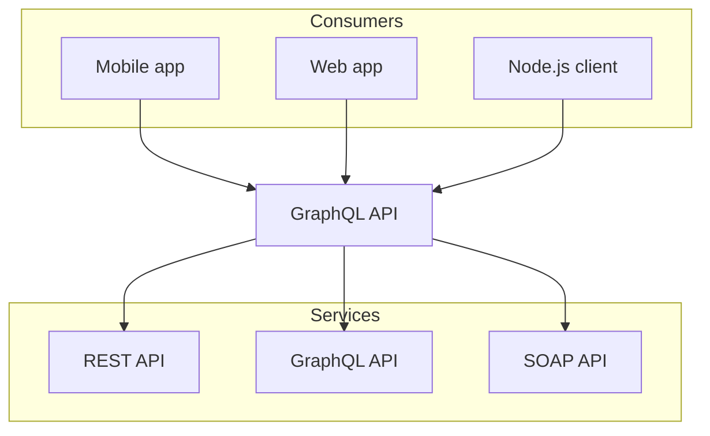

# About


## 首页

content

## 标题 2

内容

$$a=b$$

```typescript title="foo/baz.js"
const a = 1
```

<Callout type='warn'>
Hello World
</Callout>



```mermaid
graph TD;
subgraph AA [Consumers]
A[Mobile app];
B[Web app];
C[Node.js client];
end
subgraph BB [Services]
E[REST API];
F[GraphQL API];
G[SOAP API];
end
Z[GraphQL API];
A --> Z;
B --> Z;
C --> Z;
Z --> E;
Z --> F;
Z --> G;
```

